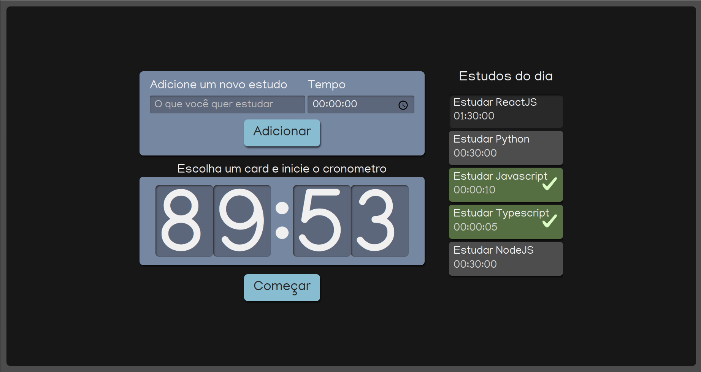

# study-timer

O Study Timer é uma aplicação para cronometrar tempo de estudo, auxiliando na organização do tempo.

## 🔨 Funcionalidades do projeto

<ol>
  <li>Cadastro de Atividade e tempo.</li>
  <li>Selecionar atividade a ser cumprida.</li>
  <li>Decrementar tempo da atividade quando clicar no botão.</li>
  <li>Após termino do tempo, atividade será marcada como concluída e não deve permitir ser selecionada novamente.</li>
</ol>

## ✔️ Técnicas e tecnologias utilizadas

Lista de tecnologias que foram usadas nesse projeto:

## 🛠️ Abrir e rodar o projeto

Para abrir e rodar o projeto, execute npm i para instalar as dependências e npm start para iniciar o projeto.

Depois, acesse <a href="http://localhost:3000/">http://localhost:3000/</a> no seu navegador.

### Projeto em produção

Este projeto pode ser visualizado neste [link](https://study-timer-six.vercel.app/).

## 📚 Mais informações

Entre em contato pelo [linkedin](https://www.linkedin.com/in/grazziano-fagundes/).
